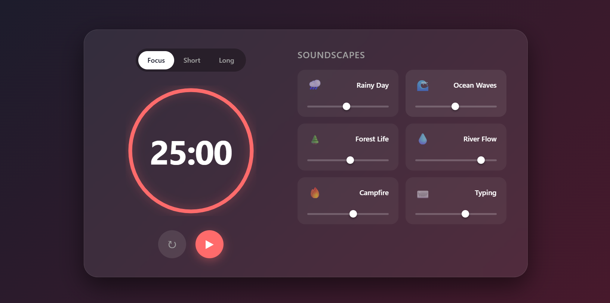

# Pomodoro-Focus-Mixer
# 🍅 Pomodoro Focus Mixer

A modern productivity tool that combines a customizable **Pomodoro Timer** with an ambient **Sound Mixer**. Designed to help you enter a state of deep flow by masking distracting noises with calming soundscapes like Rain, Forest, or Cafe ambiance.




[](https://YOUR-USERNAME.github.io/pomodoro-mixer/)

## ✨ Features

- **⏱ Smart Timer:**
  - Classic 25/5/15 minute modes.
  - Animated **SVG Circular Progress Bar**.
  - Visual and Audio alerts when time is up.
  
- **🎧 Audio Mixer (Soundboard):**
  - Multi-track support (Play Rain + Fire + Cafe simultaneously).
  - Independent volume controls for each sound.
  - **Looping audio** for uninterrupted focus.

- **💾 Auto-Save:** Uses `LocalStorage` to remember your volume levels and active sounds between sessions.
- **🎨 Glassmorphism UI:** Modern, responsive design with dark mode aesthetics.

## 🛠 Tech Stack

- **HTML5**: Semantic structure.
- **CSS3**: CSS Variables, Grid/Flexbox, SVG animations, Custom Range Sliders.
- **JavaScript (Vanilla)**: `Audio()` API, `setInterval` logic, DOM manipulation.

## 📂 Project Structure

```text
pomodoro-mixer/
│
├── index.html        # Main HTML file
├── css/
│   └── style.css     # Styling (Glassmorphism & Layouts)
├── js/
│   └── script.js     # Logic (Timer, Audio, LocalStorage)
└── README.md         # Documentation
```
🚀 How to Run
Clone the repository:

Bash
```text
git clone [https://github.com/Sherikov/pomodoro-mixer.git](https://github.com/Sherikov/pomodoro-mixer.git)
```
**Open index.html: Simply double-click the file to open it in your browser. No server required.**

⚠️ Note on Audio Autoplay
Modern browsers block audio from playing automatically to prevent spam. If you reload the page with sounds enabled, they might not play until you interact with the page (click anywhere). The code handles this gracefully by resetting the UI if autoplay is blocked.

🤝 Contributing
-**Feel free to fork this project and add more sounds or features!**
  - Fork the Project
  - Create your Feature Branch (git checkout -b feature/NewSound)
  - Commit your Changes (git commit -m 'Add Matrix sound')
  - Push to the Branch (git push origin feature/NewSound)
  - Open a Pull Request
    
📄 License
Distributed under the MIT License.
